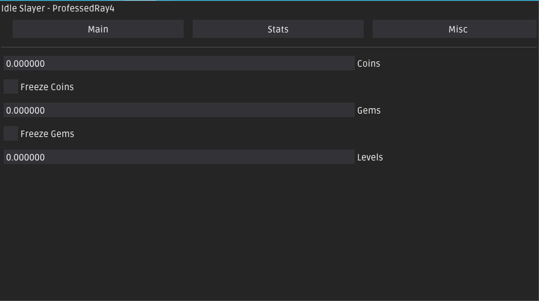

# idleSlayer

## Info
<li>This is a simple ImGui cheat for the game <i>Idle Slayer</i></li>
<li>Skid-friendly</li>
 

## Features 
### Main
<li>Coins</li>
<li>Freeze coins</li>
<li>Gems</li>
<li>Freeze Gems</li>
<li>Levels</li>

### Stats
<li>Online Eliminations</li>
<li>Offline Eliminations</li>
<li>Giant Eliminations</li>

### Misc
<li>Destroy</li>

<h1>Setting up the solution</h1>
<ul>
  <li>Download and install <a href="https://www.microsoft.com/en-us/download/details.aspx?id=6812">DirectX SDK</a></li>
  <li>Open the solution on Visual Studio and open the project Properties</li>
  <li>Go to VC++ Directories -> Include Directories. Click on 'Edit' and select the Include folder  located on your DirectX SDK installation path. It is generally this one:  %programfiles(x86)%\Microsoft DirectX SDK (June 2010)\Include\
  <li>Now go to VC++ Directories -> Library Directories. Click on 'Edit' and select the library folder   located on your DirectX SDK installation path. It is generally this one - choose x86 for 32bit and x64 for 64bit:  %programfiles(x86)%\Microsoft DirectX SDK (June 2010)\Lib\</li>
  <li>Switch Visual Studio from debug to release (64 bit) </li>
  <li>Build the solution</li>
  <li><b>Done!</b></li
</ul>

## Support

Add me on discord <i>professedray4</i>

## Credits

Universal ImGui implementation through DirectX 11 Hook (kiero)

You can find Kiero's official repository <a href="https://github.com/Rebzzel/kiero">here</a>
